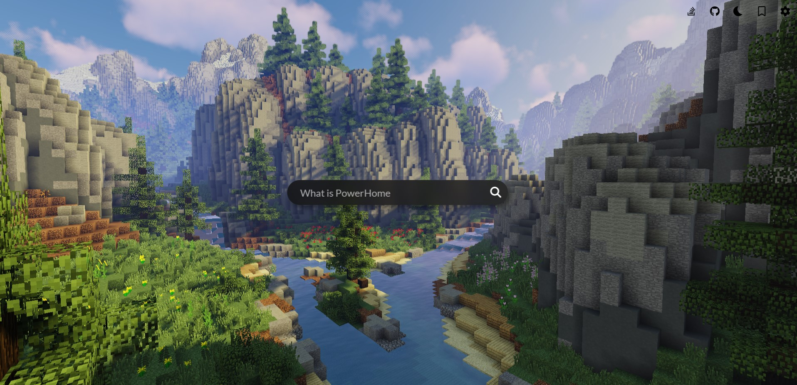

# PowerHome

Super powerful browser home screen, with Google search, advanced bookmark management and wide customization options, this is the perfect 'new tab' for every browser.



## Contributing

This app is built on top of [`Svelte`](https://github.com/sveltejs/kit/tree/master/packages/create-svelte) framework. Here's everything you need to know in order to start contributing.


### Developing

Once you've created a project and installed dependencies with `npm install` (or `pnpm install` or `yarn`), start a development server:

```bash
npm run dev

# or start the server and open the app in a new browser tab
npm run dev -- --open
```

### Building

To create a production version of your app:

```bash
npm run build
```

You can preview the production build with `npm run preview`.

> To deploy your app, you may need to install an [adapter](https://kit.svelte.dev/docs/adapters) for your target environment.

# Contributors

- Maruchero
